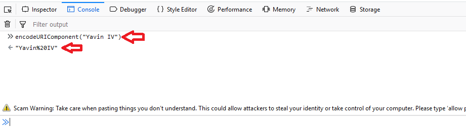

<p>
   
</p>

# DESAFIO API STAR WARS B2W - PEDRO TEIXEIRA BISOGNIN

## Índice

 <ul>
  <li><a href="#Sobre">Sobre o projeto</a></li>
  <li><a href="#Tecnologias">Tecnologias utilizadas</a></li>
  <li><a href="#Config">Configurando a API</a></li>
  <li><a href="#Testes">Efetuando testes</a></li>
  <li><a href="#Funcionalidades">Funcionalidades</a></li>
</ul> 

### <a name="Sobre">Sobre o projeto</a> 
O objetivo deste projeto é criar uma API ao qual será consumida por um jogo criado pela B2W que se aproveitará das informações da franquia Star Wars.

### <a name="Tecnologias">Tecnologias utilizadas</a> 
Para o presente projeto foi utilizado a linguagem Java na sua versão 8, com a IDE Eclipse modificada para o framework Spring Boot 2.0(Spring Tools Suite). 
Para a persistência dos dados foi utilizado o banco de dados não relacional MongoDB e para testes da api o Postman junto com o framework  JUNIT.

### <a name="Config">Configurando a API</a> 
Para utilizar o projeto deverá ser instalado o <a href="http://www.oracle.com/technetwork/pt/java/javase/downloads/jdk8-downloads-2133151.html">Java SDK 8</a>,o Eclipse, 
preferencialmente modificado para o Spring Boot o <a href="https://spring.io/tools/sts/all">Spring Tools Suite</a> e o 
<a href="https://www.mongodb.com/download-center?jmp=nav#community">MongoDB Community Server</a> baseado em seu sistema operacional.

Após isso, efetuar o download do projeto e inserir o mesmo no diretorio raiz do seu workspace do Eclipse, importar um novo projeto Maven pelo Eclipse, esperar o Maven baixar as dependências,
executar o mongoDB e dar Run em Spring Boot App no Eclipse.

Pronto, a API já estará funcionando, ela gera automaticamente o banco vazio no MongoDB. Caso ocorra algum problema da porta, você poderá entrar em application.properties e mudar server.port para alguma outra porta que desejar.

### <a name="Testes">Efetuando testes</a> 

Com o Eclipse aberto, ir em src/test/Java, escolher a parte do teste que deseja efetuar e dar run com JUNIT.

### <a name="Funcionalidades">Funcionalidades</a> 

#### Inserindo um planeta: 

Para inserir um planeta deve ser feita uma requisição post em json para o endpoint "/planetas".

Ex:
http://localhost:8080/planetas
```JSON
{
   "name": "Yavin IV",
   "Clima": "Frio",
   "terrain": "jungle, rainforests"
}
```
Será criado um novo planeta no banco de dados ao qual a ID será gerada automaticamente, não importando se o usuário setar uma id na hora da inserção. 

#### Listando todos os planetas:

Para listar todos os planetas basta fazer uma solicitação get para o endpoint "/planetas".

Ex:
http://localhost:8080/planetas

#### Fazendo busca por ID:

Para fazer uma busca por id você deverá fazer uma solicitação get para o endpoint "/planetas/" junto com a id que você quer pesquisar. 

Ex:
http://localhost:8080/planetas/5afcf2bf1d5bad0100e51bda

#### Fazendo busca por NOME:

Para fazer uma busca por id você deverá fazer uma solicitação get para o endpoint "/planetas/buscanome?nome=" junto com o nome codificado que você quer pesquisar. 

Para codificar o valor que você quer, você pode abrir seu navegador, ir em ferramentas de desenvolvedor, depois console e digitar "encodeURIComponent("Nome do planeta")" o console retornará o nome do planeta codificado como no exemplo abaixo.

<p>
   
</p>
